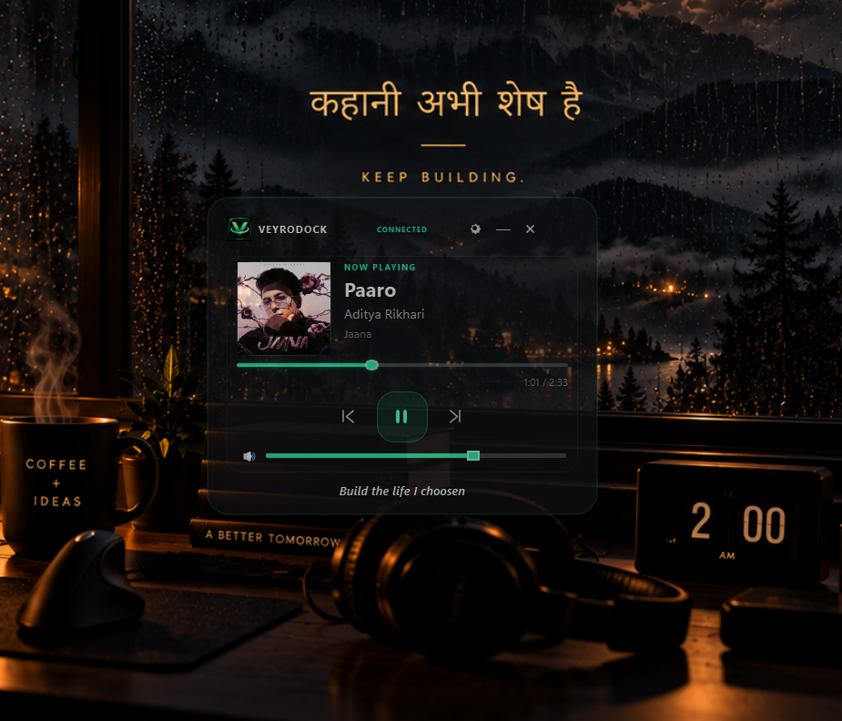
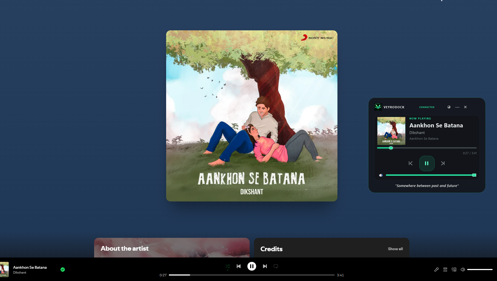
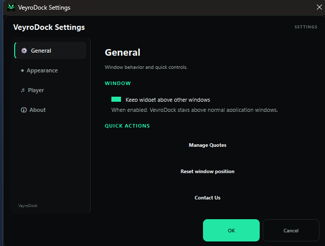
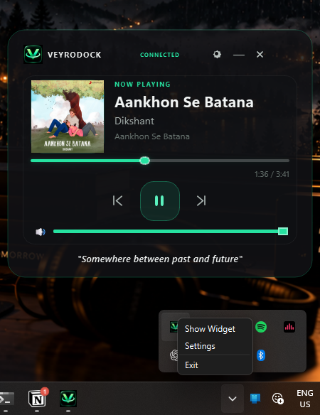
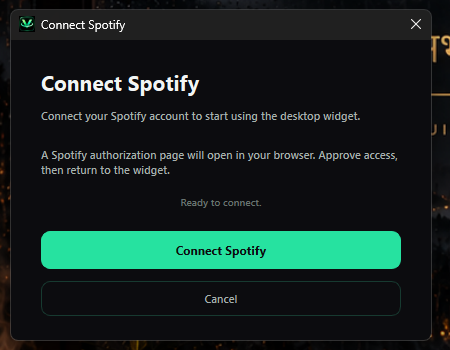

# VeyroDock

> A lightweight desktop Spotify widget for Windows.

## Download

### [⬇️ Download VeyroDock for Windows](https://github.com/manasomer0902/VeyroDock/releases/latest)

Download the latest Windows installer from the **Releases** page and run the `.exe` installer.

**Latest release:** `v1.0.0`

VeyroDock gives you quick access to your current Spotify playback without needing to keep the full Spotify window in front of you.

## Screenshots

### VeyroDock Widget



### Spotify Playback



### Settings



### System Tray



### Connect Spotify



## Features

- Connects to your Spotify account using Spotify authentication.
- Play and pause the current track.
- Skip to the next track.
- Go back to the previous track.
- Seek through the current track.
- Control Spotify volume.
- Mute and unmute volume.
- Display the current track information.
- Display album artwork.
- Open VeyroDock settings.
- Keep VeyroDock above other windows when **Keep widget above other windows** is enabled.
- Use VeyroDock from the Windows system tray.
- Remember supported application settings such as window position and preferences.
- Use the VeyroDock application icon throughout the desktop application.

## Requirements

VeyroDock is currently intended for Windows.

You need:

- A Spotify Premium account.
- Spotify playback available on your account/device.
- The VeyroDock application.

## Getting Started

### Using the packaged application

1. Download the latest installer from the [VeyroDock Releases](https://github.com/manasomer0902/VeyroDock/releases/latest) page.
2. Run the installer and launch VeyroDock.
3. If this is your first launch, use the connection option to connect VeyroDock to Spotify.
4. Complete the Spotify authentication flow.
5. Once connected, VeyroDock will display your current playback.
6. Use the widget controls to control playback, seek, and volume.

### Running from the Python project

If you are running the source project instead of the packaged application:

```powershell
.venv\Scripts\activate
python -m app.main
```

The Python project requires the dependencies listed in `requirements.txt`.

## Playback Controls

VeyroDock provides quick controls for:

- Previous track
- Play / pause
- Next track
- Track seeking
- Volume
- Mute / unmute

The volume control is designed so the slider responds immediately while volume updates are sent after the user pauses briefly.

## Track Information

When Spotify provides playback information, VeyroDock can display:

- Song name
- Artist
- Album
- Album artwork
- Current playback position
- Track duration
- Playing / paused state

## Settings

VeyroDock includes a settings page for supported application preferences.

One of the available behaviors is **Keep widget above other windows**:

- **Enabled:** VeyroDock stays above normal windows.
- **Disabled:** VeyroDock behaves like a normal window and can move behind other windows.

## System Tray

VeyroDock can run through the Windows system tray.

The tray integration provides access to the application while keeping the desktop widget available without requiring the main application window to remain in focus.

## Project Structure

The main application is organized into separate areas for configuration, Spotify integration, services, UI components, icons, and screenshots:

```text
app/
├── config/
├── services/
├── spotify/
├── ui/
└── main.py

assets/
├── icons/
└── images/
    ├── veyrodock-main.png
    ├── veyrodock-spotify.png
    ├── veyrodock-settings.png
    ├── veyrodock-tray.png
    └── veyrodock-connect.png
```

## Building the Windows Application

The project can be packaged with PyInstaller.

From the project root:

```powershell
pyinstaller --noconfirm --clean --windowed --name VeyroDock --icon="assets/icons/veyrodock.ico" --add-data "assets;assets" app/main.py
```

The packaged application is generated under:

```text
dist/
```

## Development

The project uses Python and PySide6 for the desktop application.

Install the project dependencies with:

```powershell
pip install -r requirements.txt
```

Then run:

```powershell
python -m app.main
```

## Notes

- VeyroDock is a desktop client/widget for controlling Spotify playback.
- Spotify authentication and playback access depend on Spotify's available services and the account/device being used.
- Keep your local authentication and configuration files private.
- The `data/` directory may contain local application data and should not be shared publicly.

## License

No license information is currently specified in the project.

## Project Status

VeyroDock is currently packaged as a Windows desktop application and has been tested as a packaged executable.

---

**VeyroDock** — a compact Spotify companion for your Windows desktop.
